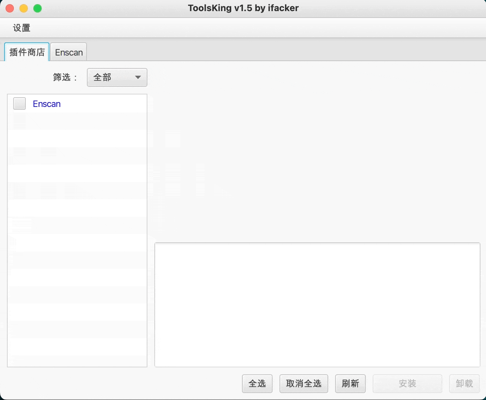

# ToolsKing
---  
## 免责声明：
本网络安全工具仅用于提供技术支持，不涉及任何应用或商业行为。用户在使用本网络安全工具的过程中，不得以任何方式损害他人的合法权益。

该工具的运行仅依赖用户提供的信息，并不包括任何违反相关法律法规的内容。用户在使用本网络安全工具时，必须确保其提供的信息合法、有效、真实可靠，否则可能会产生不利后果。

本软件提供的服务仅供参考，不构成任何责任。用户在使用本网络安全工具时，应自行承担有关安全风险。我们并不对使用者使用本工具所涉及的任何技术服务承担任何义务或责任，无论此类技术服务是否有任何损失和/或损害。

## 温馨提示：
如果出现程序打不开、报错，可能是每次更新版本后，配置文件版本不匹配导致，可以尝试删除原来的配置文件`config\ ` 文件夹，然后重试打开即可。

## 使用截图：

## 支持的插件：
1. [Enscan](https://github.com/ifacker/Enscan_jar)

## 版本：

### v1.5.1 🐭  
本次更新的新功能：  
1. 标签页设置了最小宽度，不会再参差不齐了（强迫症更新）

### v1.5 🐭   
本次更新的新功能：
1. 新增代理站点下载的选项，勾选后可直接从 github 上下载，位置在 `设置 -> 设置源`
2. 新增插件下载失败提醒
3. 新增在线更新功能，可以点击`设置 -> 更新`
4. 删除了 gitee 库，并且以后也不会在用了，至少对我来说，gitee 给我的开发造成了很大的困扰

### v1.4 🐱
本次更新，更新了插件接口，所以之前下载的插件，需要全部删除，并重新下载。

### v1.3 🐶 
目前软件主体暂时没有什么问题，当然，也有可能是我没发现，总之，欢迎大家提交 Issuse！

## 其他链接：
[ToolsKing_github](https://github.com/ifacker/ToolsKing)  

[插件开发_github](https://github.com/ifacker/ToolsKing_Plugin "欢迎大家一起前来开发")  

[插件仓库_github](https://github.com/ifacker/ToolsKingPluginLib "欢迎大家一起前来添加")  
